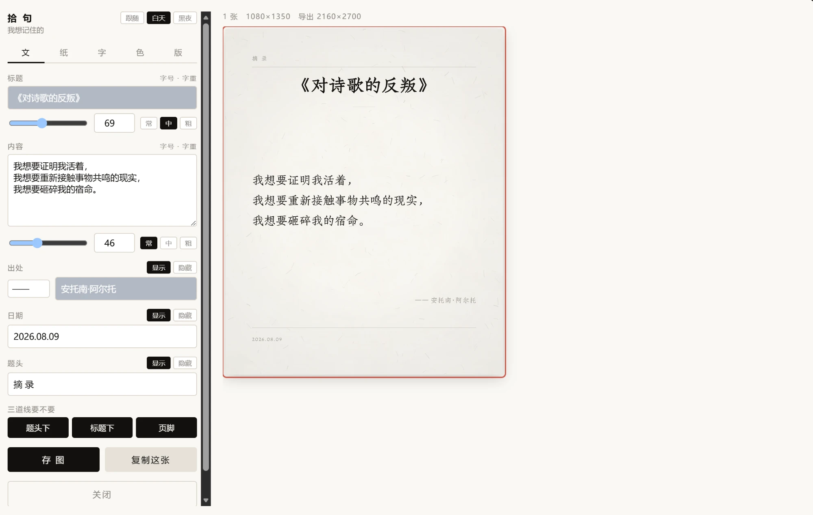
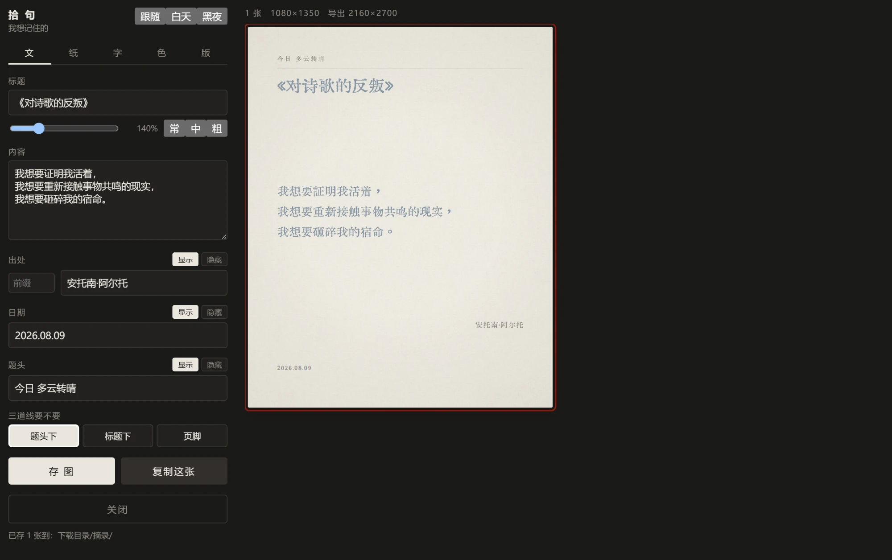
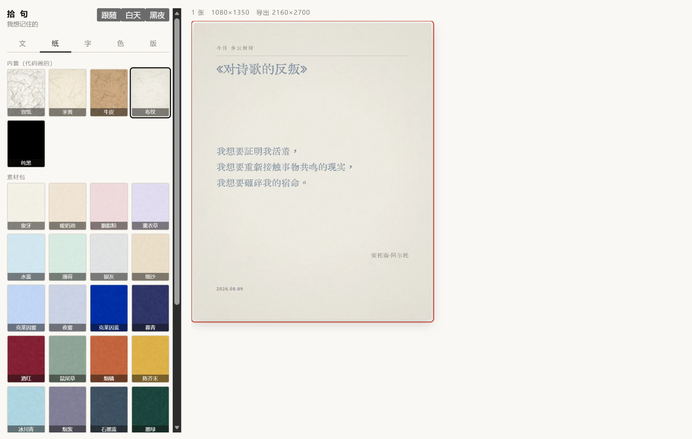
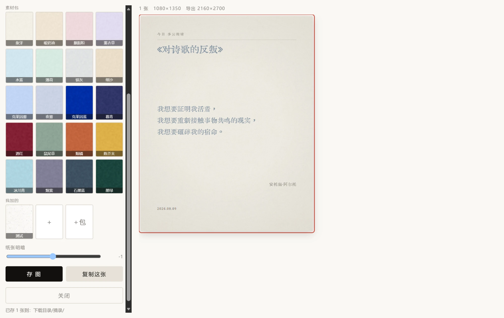
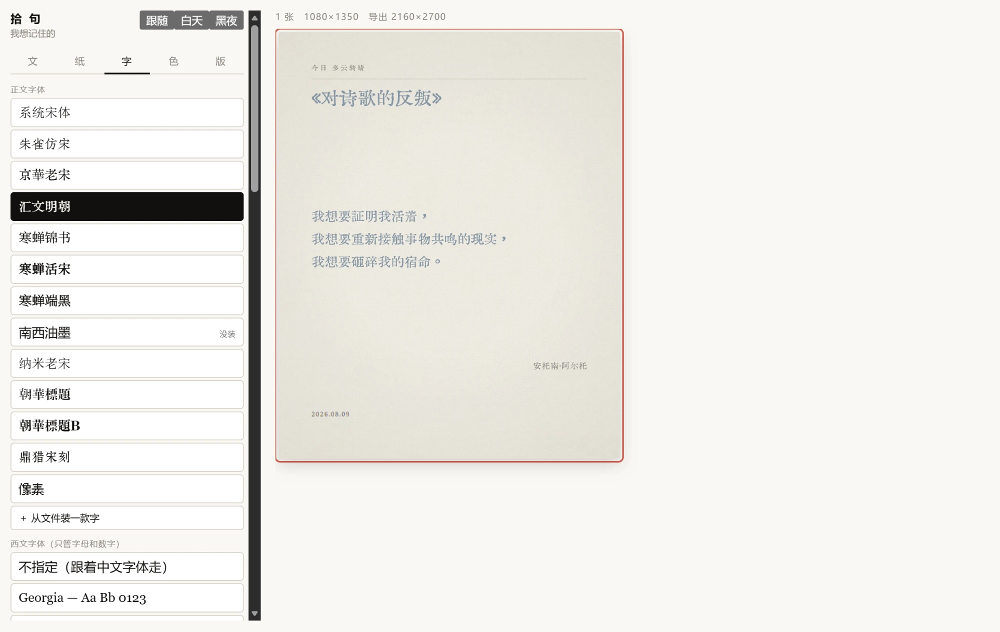
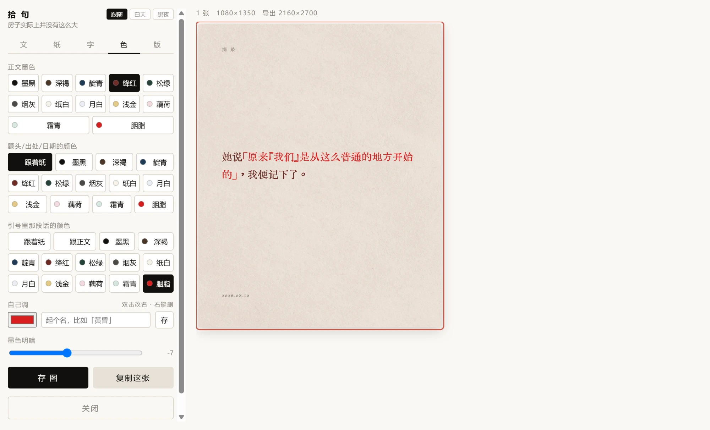
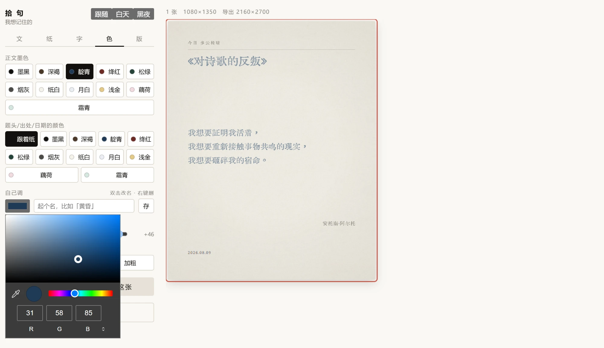
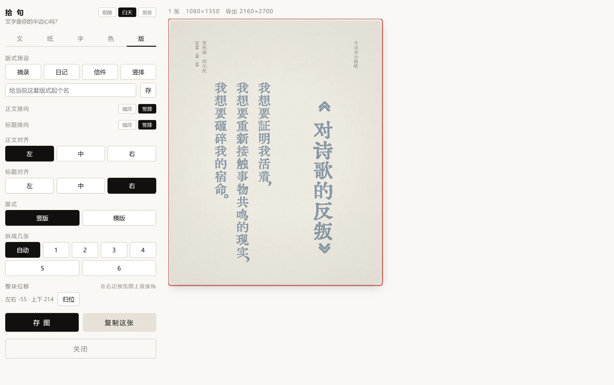
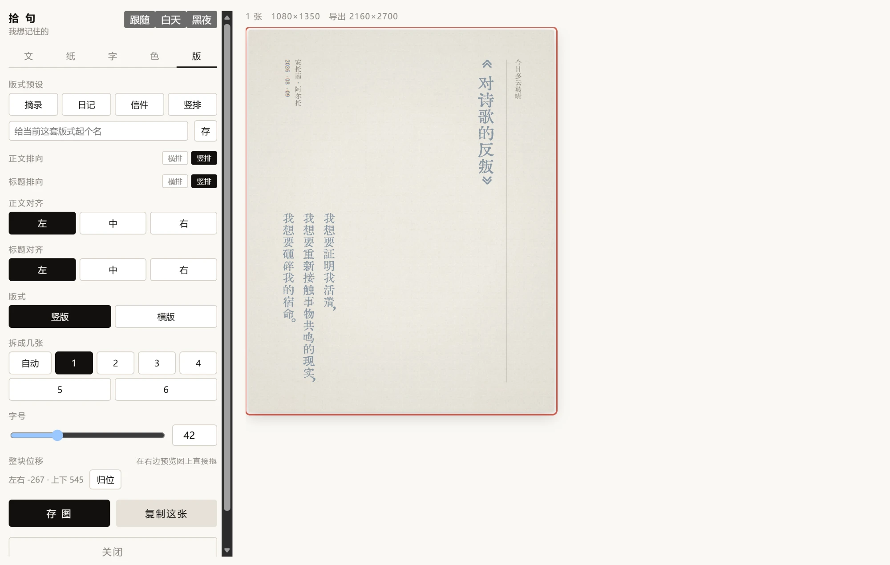

# 拾句

在任意网页上选中一段文字，把它排成一张纸上的摘录，存到本地。
不选文字也行 —— 开一张白纸，日记、随笔直接在里面写。

Claude、ChatGPT、小红书、任何网页都能用。
**酒馆（SillyTavern）里也能用，而且不用装篡改猴 —— [在它的「扩展」里贴个链接就行](#装进酒馆sillytavern)。**



---

## 这是什么

一个油猴脚本（**同一个文件也是酒馆的扩展**）。
它做的事只有一件：**把一段文字，认认真真排到一张纸上**。

不是加个滤镜、套个模板 —— 是真的排版：中文避头尾、英文整词不断行、
竖排时标点分类处理、按对比度自动配墨、内容多了自动拆成好几张信纸。

纯前端 canvas 渲染，**不依赖任何库**，不联网，不上传，不收集任何东西。
所有设置存在油猴里，跨网站共享 —— 纸、字、墨、版式设一次，所有网站通用。

---

## 先读这一段，能省你很多时间

**这个仓库里没有「App」。** 点开 `shiju.user.js` 会看到一屏代码 —— **那是正常的**，
它是个「代码文件」，不是能双击运行的程序。

要用它，得让**浏览器**去跑。中间需要一个叫「**用户脚本管理器**」的浏览器插件
（电脑上是 **Tampermonkey / 篡改猴**，iPhone 上是 **Userscripts**），
它负责在你打开网页的时候把这段代码塞进去。装好之后你就再也不用管它了。

| 你在什么设备上 | 需要什么 | 能用吗 |
|---|---|---|
| **电脑（Chrome / Edge）** | 篡改猴 | ✅ 完整功能 |
| **iPhone / iPad** | **Safari** + Userscripts | ✅ 能用，[有两处限制](#装在手机上iphone--安卓) |
| iPhone 上的 Chrome / Edge / 夸克 / QQ 浏览器 | —— | ❌ **不行**，苹果只给 Safari 开了扩展接口 |
| **安卓** | X浏览器 / Via（自带脚本功能），或 火狐 + 篡改猴 | ⚠️ 应该能用，**没人实测过** |
| **酒馆（SillyTavern）** | 什么都不用装 —— [在它的「扩展」里贴个链接](#装进酒馆sillytavern) | ✅ 实测过 |

**一句话：先照下面「装在电脑上」走一遍，跑通了再考虑手机。
只在酒馆里用的话，直接跳到[装进酒馆](#装进酒馆sillytavern)那一节，不用装篡改猴。**

---

## 目录

1. [装在电脑上（Chrome / Edge）](#装在电脑上chrome--edge) —— 装插件 → 装脚本 → 刷新，**新手从这儿开始**
2. [装在手机上（iPhone / 安卓）](#装在手机上iphone--安卓) —— iPhone 只能用 Safari；含 iOS 的两处限制
3. [怎么把它唤出来](#怎么把它唤出来) —— 三条路，手机上是**三指轻点**
4. [🚨 在浏览器的起始页上按了没反应？那是正常的](#-在浏览器的起始页上按了没反应那是正常的) —— 浏览器自己的页面不给任何扩展跑
5. [面板分五屏](#面板分五屏) —— 文 / 纸 / 字 / 色 / 版，每屏只管一件事
6. [多页拆分](#多页拆分) · [排版做了哪些事](#排版做了哪些事) · [存图](#存图)
7. [常见问题](#常见问题) —— **没出现「摘」**、链接打不开、iPhone 上没反应、说存了却找不到文件、会不会被封号，都在这儿
8. [随仓带的 20 套信纸](#随仓带的-20-套信纸) · [信纸素材规格](#信纸素材规格) · [字体授权](#字体授权)
9. [装进酒馆（SillyTavern）](#装进酒馆sillytavern) —— **贴个链接就装**，不用篡改猴；也讲了它为什么能这么装
10. [它到底做了什么](#它到底做了什么) —— 不联网、不上传，以及那个 `@connect *` 是干嘛的

---

## 装在电脑上（Chrome / Edge）

从没装过浏览器插件也没关系，一步一步来，两分钟。

### 第 1 步：装篡改猴

用电脑打开 Chrome 或 Edge，进这个网站：

<https://www.tampermonkey.net/>

点进去选你的浏览器，按提示装上。装完浏览器右上角会多一个**灰黑色的小图标**
（可能藏在那个拼图形状的「扩展」按钮里，点开能把它固定出来）。

> 🚨 **装完还有一步，绝大多数人卡在这儿：浏览器默认不许扩展跑用户脚本。**
>
> - **Chrome 138 及以上**：地址栏输 `chrome://extensions` → 找到 Tampermonkey →
>   点「**详细信息**」→ 打开「**允许用户脚本**」开关
> - **更早的 Chrome**：同一页右上角打开「**开发者模式**」
> - **Edge**：地址栏输 `edge://extensions` → 左下角打开「**开发人员模式**」
>
> 没开这个开关的表现特别迷惑人：脚本明明装上了、篡改猴面板里也看得见，
> 但你在网页上选中文字**就是不冒出那个「摘」**。篡改猴自己通常会提示
> 「此脚本还未被执行」。一发现没反应，先回来查这一项。

### 第 2 步：装脚本

点这个链接：

<https://raw.githubusercontent.com/willwefind/shiju/main/shiju.user.js>

篡改猴会自动弹出一个安装页面，点 **安装** 就好。

> 如果没弹安装页、只看到一屏代码，说明篡改猴没装好或没启用。
> 那就手动来：点右上角**篡改猴图标 →「添加新脚本…」**→ 把编辑器里自带的几行
> **全选删掉** → 把那一屏代码粘进去 → 按 `Ctrl+S` 保存。

> 🌏 **那个链接打不开？显示「无法访问此页面」？**
>
> 不是网址打错了，也不是篡改猴的问题 —— 是你的网络连不上
> `raw.githubusercontent.com`。**它和 github.com 是两个域名，经常一个通一个不通**
> （能看到这份说明、却打不开上面那个链接，就是这种情况）。
>
> **绕开它：**
>
> 1. 回到**仓库首页**（你既然在看这份说明，它就是通的）
> 2. 点开 **`shiju.user.js`** 这个文件
> 3. 代码区右上角有一排小按钮，点那个**复制图标**
>    —— ⚠️ 别点 Raw 和 Download，那两个还是会跳到打不开的域名
> 4. 右上角**篡改猴图标 →「添加新脚本…」**
> 5. 编辑器里自带的几行**全选删掉**，粘贴，`Ctrl+S`
>
> 脚本头里写了 `@updateURL`，所以**就算是手动粘贴装进去的，篡改猴以后也会自己去查更新**
> —— 前提是你的网络当时连得上 `raw.githubusercontent.com`。连不上就还是把这几步再走一遍。

> 🩹 **装不上？** 三种症状分别怎么办，写在
> [常见问题](#q点了链接浏览器却把它当文件下载了还说可能会损害你的设备)那儿。
> **不想排查就走最稳的这条，它从来不会卡**：
> 篡改猴面板 → **＋（新建脚本）**（旧的还在就点开它选**编辑**）→
> 编辑器里**全选删掉** → 把 [`shiju.user.js`](shiju.user.js) 整个粘进去 → `Ctrl+S`。

### 第 3 步：刷新页面

**用户脚本只在页面加载那一刻注入。** 你装脚本之前就开着的那些标签页，
里面是没有它的 —— 刷新一下（`F5`）才有。

---

## 装在手机上（iPhone / 安卓）

> ✅ **iPhone 实机走通过**（Safari + Userscripts：装脚本 → 刷新 → 选中文字 → 出图）。
> ⚠️ **安卓没有实机验过**，那一节照的是各浏览器自己的文档。
> 面板的手机版排布是在电脑浏览器的手机模拟下量的（375px：预览在上、控制在下、
> 整张卡片一眼看得全、不横向溢出、手指能拖动整块位移）。
> 你要是卡住了，欢迎来提 issue，我们照实改这一节。

### iPhone / iPad

**1. 装 Userscripts**（App Store 搜，免费开源）。iOS 上没有 Tampermonkey，那个只有 Mac 版。

打开它一次，它会让你**指定一个存脚本的文件夹** —— 在「文件」App 里新建一个就行。

**2. 打开扩展**：设置 → Safari → 扩展 → **Userscripts** 打开，
网站权限选「**所有网站 → 允许**」（选「始终允许」省事，不然每次都要点）。

> 🚨 **别在「无痕浏览」里用**，扩展在无痕标签页里默认是不跑的。

**3. 装脚本**：Safari 打开下面这个地址 ——

<https://raw.githubusercontent.com/willwefind/shiju/main/shiju.user.js>

然后点地址栏的 **ᴀA → Userscripts**，弹出的面板里会出现**安装提示**，点它按提示装完。
不用去「文件」App 里放文件。

> Userscripts 认的是**网址路径以 `.user.js` 结尾**（`?` 问号和 `#` 井号后面的不算）。
> 上面这个地址正好是，所以它认得。
>
> **要是那个地址打不开**（`raw.githubusercontent.com` 在有些网络下连不上），
> 就退回手动那条：去仓库首页点开 `shiju.user.js` 全选复制 →
> **ᴀA → Userscripts → 新建脚本** → 粘贴保存。
>
> Userscripts 需要 **iOS 15.1 以上**。

**4. 装完刷新一次页面**（实测过，不刷新那一页是没有脚本的）。

**5. 用**：随便打开一个有正文的网页 → **长按选中一段文字** → 冒出「摘」→ 点它。
不想先选文字、直接开一张白纸的话：**三根手指在屏幕上轻点一下**。

**6. 存图**：点「存 图」之后图片进 Safari 的下载（右上角箭头）或「文件」App。
也可以在预览图上**长按 → 存储到照片**。

> ⚠️ **iOS 上有两处和电脑不一样，是 Userscripts 本身的限制，不是脚本偷懒：**
>
> 1. **设置只在当前这个网站记得住。** 电脑上油猴的存储是全网共用的，
>    纸、字、墨设一次处处通用；iOS 上退回浏览器的本地存储，**按网站分家** ——
>    在 A 站设好的纸，换到 B 站要再设一次。
> 2. **信纸素材包（3MB 多）多半存不下**，浏览器给每个网站的空间只有 ~5MB。
>    导进去当次能用，换一页就没了 —— 真存不下的时候面板会明说，不会假装存好了。
>
> 想知道自己这边是哪种，看下一节的**自检**，它会写明「设置存在哪」。

### 安卓

安卓的 **Chrome 装不了扩展**，所以不能照电脑那套走。两条路，任选其一。

**路线 A：X浏览器 / Via 浏览器（省事，不用装插件）**

这类国产轻量浏览器**自带脚本功能**。

> ⚠️ 它们里面有个「**精选用户脚本**」页面 —— 那是浏览器自带的脚本市场，
> **我们这个不在里面**，在那儿翻是找不到的。要走下面「装外部脚本」这条路。

1. 应用商店搜 **X浏览器** 或 **Via 浏览器**（都是几 MB 的小软件）
2. 用它打开脚本地址：`https://raw.githubusercontent.com/willwefind/shiju/main/shiju.user.js`
   —— 浏览器认得 `.user.js`，通常直接弹「是否安装此脚本」，点安装
3. 没弹出来就手动加：**菜单 → 脚本管理 / 用户脚本 / 油猴脚本**（各版本叫法不一样，
   可能在「工具箱」或「设置」里）→ **新建 / 添加** → 填那个网址；
   只能粘代码的话，就去那个网址全选复制，整段粘进去保存
4. 打开一个有正文的网页 → **刷新一次** → 长按选中文字 → 「摘」

**路线 B：火狐（Firefox）安卓版 + Tampermonkey**

想用和电脑一样的篡改猴就走这条。火狐安卓版支持扩展（只能装它推荐列表里的，篡改猴在列表里）。

1. 应用商店装 **Firefox**
2. 菜单（右下角三个点）→ **扩展 / 附加组件** → 搜 **Tampermonkey** → 添加
3. 点上面那个脚本地址，篡改猴弹安装页，点**安装**
4. 打开网页 → 刷新 → 长按选中文字 → 「摘」

> 🚫 **别再用 Kiwi 浏览器**。它以前是安卓上装 Chrome 扩展最常见的选择，作者已停止开发。

---

## 怎么把它唤出来

三条路，随便用哪条：

| 怎么做 | 什么时候用 |
|---|---|
| **选中一段文字** → 旁边冒出 **「摘」** → 点它 | 最常用，手机上也是这条 |
| **选中一段文字** → 按 **`Alt + Q`** | 不想动鼠标（电脑） |
| **什么都不选** → 按 **`Alt + Q`**；或点**篡改猴图标 → 拾句：写点什么** | 开一张白纸自己写（电脑） |
| **什么都不选** → **三根手指在屏幕上轻点一下** | 开一张白纸自己写（**手机**） |

> **手机上为什么是三指？** 手机没有 `Alt` 键；而 iOS 的 Userscripts **没有脚本菜单**
> （它不支持 `GM_registerMenuCommand`），所以「不选文字直接开」原本一个入口都没有。
> 三指轻点是挑出来的：网页几乎用不到这个手势，iOS 系统的三指手势也只在输入框里管撤销重做
> —— 所以在输入框上点不会抢。轻点就行，按住不放或者划开都不算。

**内容框本来就是个自由文本框**，所以「摘录」只是它的一种用法 ——
写日记、写随笔、抄一段想留下的字，都可以直接在里面打。
空手起稿时出处默认留空（那是你自己写的话，不是从这个网页摘的），光标直接落在内容框。

---

## 🚨 在浏览器的起始页上按了没反应？那是正常的

**浏览器自己的页面不给任何扩展和用户脚本跑。** **Chrome 和 Edge 都实测过，一样。** 包括：

- 打开浏览器就看到的那个**起始页 / 新标签页**（`edge://newtab` / `chrome://newtab`）
- `about:blank` 空白页
- 设置页、扩展管理页、浏览器自带的下载页
- 扩展商店（Chrome 网上应用店 / Edge 加载项）的页面

这是浏览器定的规矩，不是脚本坏了，也没有开关能打开。

**怎么办**：随便打开一个**真的网页**再试，比如 <https://github.com> 、
一篇文章、一个聊天页面。有正文可选中的页面都行。

---

## 面板分五屏

东西一多，平铺的按钮墙就没法选了，所以拆成五屏，每屏只管一件事。

### 「文」—— 写什么


| 项 | 说明 |
|---|---|
| **标题** | 留空就没有标题。下面那一行是**标题自己的字号和字重** |
| **内容** | **你敲的回车照断**。空一行＝分段（段间留空档），单个回车＝硬换行。下面那一行是**正文自己的字号和字重** |
| **出处** | 左边小框是**前缀**（默认 `——`，想删就清空，想换成别的随便填），右边是正文。可显示/隐藏 |
| **日期** | 可编辑、可隐藏。想给旧文字标旧日期就直接改 |
| **题头** | 左上角那个小标签。默认「摘 录」，可以改成「日 记」「随 笔」或者任何字，会记住 |
| **三道线** | 题头下 / 标题下 / 页脚，**各自可开可关**，按钮亮着就是要 |

标题、题头、出处**都不限字数**，太长会自己折行（竖排时折成多列），
占位跟着实际行数走，不会冲出版心。

#### 字号和字重：标题一套，正文一套，互不干涉

标题框下面和内容框下面，各有一行**一模一样**的控件：

```
[———— 滑块 ————]  [数字]  [常][中][粗]
```

- **左边滑块**拖着调，**右边数字框**可以直接输入 ——
  正文滑块 20–96、输入最大到 200；标题滑块 20–140、输入最大到 300
- **常 / 中 / 粗**是字重

**两套是绝对独立的。** 调正文字号，标题一动不动；调标题字号，正文一动不动。

> 早先标题字号存的是「正文的百分之多少」，于是一改正文字号标题就跟着变，
> 想把两者分开调根本做不到。现在标题字号是**它自己的像素值**。
> 你以前存下来的版式会自动换算过去，不用重存。

右上角还有 **跟随系统 / 白天 / 黑夜** 三档主题 —— 只影响面板本身，不影响出的图。



---

### 「纸」—— 铺在底下的东西



**内置五张全是代码画出来的**，不带任何素材文件：宣纸 / 米黄 / 牛皮 / 布纹，
外加一张**纯黑**（纯黑就是纯黑，零纹理 —— 加了云斑草屑反而脏）。

四张有纹理的纸都是现场生成的：多层柔光云斑 + 细颗粒 + 随机草屑纤维 + 四角压暗，
布纹那张还有一层织纹（画成短促断线而不是连续直线，否则任何缩放比例下都会起摩尔纹）。

**导入素材包** —— 按 **＋包** 选一个 `.json`，导一次就常驻，所有网站通用。
包里的纸**横竖成对**，选纸时按当前版式自动取对应那张，一个像素都不用裁。

仓里**已经带了一个现成的包**：`papers/letterpaper-20sets.pack.json`，20 套 40 张，
下载下来直接导即可 —— 见下面[「随仓带的 20 套信纸」](#随仓带的-20-套信纸)。
用 [`tools/make-pack.py`](tools/make-pack.py) 也可以把自己的一堆图打成包。



**加自己的图** —— 按 **＋** 选图片（可多选）。**双击**一张纸改名，**右键**删掉。
文件名要是 `1.jpg` 这种没信息量的，不会拿来当名字，会叫「我的纸1」。

底下还有一条 **纸张明暗**（−50…+50）。

---

### 「字」—— 用什么写



三档：**正文字体 / 西文字体 / 标题字体**。

**每一行都用它自己的样子写出自己的名字** —— 挑字体本来就该这么挑。

> **拾句用的是你电脑里已经装好的字体，它自己不带字。**
> 中文那一档，没装的会**灰掉并标「没装」**；
> 西文那一档**只列真装了的** —— 所以你要是一款都没装，那儿就只有「不指定」一项，
> 那是正常的，不是坏了。

**西文字体是单独一档**，它拼在中文字体**前面**，只接管字母和数字，
汉字自动落回中文字体。

> ⚠️ 为什么需要这一档：很多中文字体（比如 SimSun）自带的拉丁字母是**等宽**的，
> 英文排出来像打字机。指定一款西文字体就治好了。

**标题字体中英文都能挑** —— 挑了英文字时它管拉丁字母，汉字仍落回正文的中文字体。

#### 仓里附的那 10 款英文字，怎么才能用上

`fonts/` 里附了 10 款英文字体（IM Fell English、Special Elite、Limelight、
Uncial Antiqua、Beau Rivage、Jim Nightshade …）。**它们不会自动生效** ——
拾句不内嵌网页字体，只认你机器上已经有的字。所以要用就得先把文件弄到本地，两条路：

| | 怎么做 | 好处 | 代价 |
|---|---|---|---|
| **A. 装进系统** | 下载 `fonts/` 里的 `.ttf` / `.otf`，双击 → 安装 | 一次装好，**所有软件**都能用（PS、Word 都行） | 装完必须**完全退出浏览器再开**，见下面那条 |
| **B. 只装进拾句** | 面板 → 字 → **＋ 从文件装一款字** → 选那个字体文件 | **不用装系统、不用重开浏览器**，而且跨网站通用 | 只有拾句里能用；字体文件大的话会占存储 |

**文件从哪来**：仓库的 [`fonts/`](fonts/) 目录，每款一个文件夹，授权原文也在里面。

> 💡 **装成酒馆扩展的人，文件已经在你硬盘上了** —— 酒馆是把整个仓库 clone 下来的：
> `SillyTavern\data\default-user\extensions\shiju\fonts\`
> （跟[那 20 套信纸](#-随仓那-20-套信纸也跟着进来了--但你得知道它在哪)一样）。

**一款都不装也完全能用** —— 中文那一档列的是 Windows / Office 自带的那些，人人都有。
这 10 款是「想要点别的味道」时才用得上的。

> **字体装进系统了却还是灰的？** 要**完全退出浏览器再开**。
> Chrome 系在进程启动时就把字体列表读死了，不会热加载。
> 嫌麻烦就走上面的 B 路，那条不用重开。

---

### 「色」—— 墨是什么颜色



**正文墨色** 11 支预设：墨黑 · 深褐 · 靛青 · 绛红 · 松绿 · 烟灰 · 纸白 · 月白 · 浅金 · 藕荷 · 霜青。
后面五支浅色是给浓色纸准备的 —— 深蓝深绿的纸上黑字根本读不出来。

**题头 / 出处 / 日期的颜色**可以单独设，默认「跟着纸」（纸深就自动提亮）。

**引号里那段话的颜色**也可以单独设（v0.16.7 起）。默认「跟着纸」＝浅纸上是一抹橙、
深纸上自动提亮；选「跟正文」就是**跟正文一个色，也就是不要引号变色**；
也可以指定任何一支墨，包括自己调的那些。

> 一张纸上正文墨 + 引号色 + 题头色已经是三种颜色了，再花就散。
> 整段本身就是引文的时候，「跟正文」往往比留着那抹橙好看。

**自己调** —— 用系统原生取色器（Windows 上是完整调色板加吸管）。
**拖的时候就直接用上**，不必先存；满意了起个名按「存」，之后**双击改名、右键删**。



还有 **墨色明暗**（−50…+50）。

> **字重不在这一屏**，在「文」那屏 —— 标题和正文各有各的，见上面。
>
> 字重不用 `bold` 关键字：中文字体大多只装了 Regular，浏览器合成的假粗各家不一样、
> 也没法微调。这里用的是同色描边加粗，任何字体都吃，粗细可控。

#### 墨色会自动配

换到浓色纸时，如果当前这支墨在新纸上的**对比度低于 3.2**（读不出来），
会自动换成对比最好的那支，并在下面告诉你一声。够读的话就不动你的选择。

判据用的是 WCAG 相对亮度对比度，纸色取的是**调完明暗之后**的实际颜色 ——
所以你拖了纸张明暗，这套判断依然准。

---

### 「版」—— 怎么排



**版式预设** —— 内置 摘录 / 日记 / 信件 / 竖排 四套，点一下换整套外观。
调到满意可以起名存下来（双击改名、右键删）。
预设里存的是**纸、字、色、排版**全套，所以叫版式而不是排版。
**换版式不动你写的字** —— 内容、出处、日期不在预设里。

**正文排向 / 标题排向分开选**，四种组合都是成立的排法：

| | 标题横 | 标题竖 |
|---|---|---|
| **正文横** | 常规 | 竖标题立在顶上那条带里，像个签条 |
| **正文竖** | 横标题压顶，现代排法 | **标题自成一栏立在右边**，正文列在它左边 —— 传统竖排书的样子 |

**对齐** —— 正文和标题各有左 / 中 / 右。**是在版心里对齐，不是贴到纸边**。

**版式** —— 竖版 1080×1350（4:5）· 横版 1350×1080（5:4）。导出都是 2 倍图。

**拆成几张** —— 见下一节。

> **字号不在这一屏**，在「文」那屏 —— 标题和正文各有各的，见上面。

**整块位移** —— 在右边预览图上**直接拖**，整块文字跟着挪，「归位」清零。



> 不做逐元素自由拖放 —— 那和自动分页是互斥的，一旦每块字都能随便放，
> 就没法自动流到下一张纸了。整块拖保住了分页。

---

## 多页拆分

内容多了不必挤在一张纸上。

- **自动** —— 按标准信纸高度装满几张算几张
- **指定张数（1–6）** —— 尽量平均分（40 行分 3 张 = 13/13/14）

要是字太多、张数太少装不下，就把**整叠一起加高**（不会偷偷多给你一张），
并在预览上方写明。反过来内容太短拆不出那么多张，也会写明。

**导出前每一张都画出来给你看**，点一张选中它。
题头每张都印；**出处只印最后一张**；多张时页脚中间有「一 / 三」这样的中文页码。

---

## 排版做了哪些事

这一节是给在意排版的人看的。

- **避头尾** —— 句读不站行首、开引号不留行尾。塞不下时用「追出」
  （把上一行最后一个字一起拉到下一行），而不是让行溢出版心
- **英文整词不断行** —— `ai-runtime-lab`、`2026-08-09` 这类整体不拆
- **折行算字距** —— 题头和出处是带字距描着画的，折行时把字距一起算进去
- **引号变色** —— `「」『』""` 里的话变成另一个颜色，**颜色可自选**（也可以关掉，见「色」屏）；
  一句话说到第二行、甚至翻到下一页，颜色都不会断掉
- **首行不缩进** —— 卡片排版不是书籍正文，缩进反而碎
- **正文垂直居中** —— 横版尤其需要，顶对齐会让字全挤在上面

**竖排**另有一套：字从上往下、列从右往左，标点分三类各自处理 ——
`。，、` 挪到格子右上角，`「」（）—…` 转 90°，
英文整串顺时针转 90°（所以读起来是正的）。
题头立在右边、出处和日期立在左边，分隔线也跟着变成竖的。

---

## 存图

**存图**把所有张一次存完，文件名 `摘录_时间_1of3.jpg`。
**复制这张**只复制你选中的那一张（放进剪贴板，可直接粘）。

存到 `浏览器下载目录/摘录/`。想换文件夹：篡改猴菜单 →「设置保存子目录」。
（想让它直接落到某个盘，把浏览器的下载目录设成那儿就行。）

> ⚠️ **子目录只有电脑上有效。** 它靠的是篡改猴的下载接口；
> iPhone 上没有那个接口（也没有脚本菜单），图片直接落在系统的下载位置。

导出是 2 倍图：竖版 2160×2700、横版 2700×2160，JPEG q0.94。

---

## 常见问题

### Q：选中文字了，「摘」就是不出来？

按顺序排掉这五件事，九成在前两条：

1. 🚨 **这一页是不是在你装脚本之前就开着的？** —— 按 `F5` 刷新。
   **用户脚本只在页面加载那一刻注入**，装脚本时开着的标签页是「装之前」的，
   它不会自己变出按钮来。这一条最常见，也最容易被跳过。
2. 🚨 **是不是在浏览器自己的页面上？** —— 起始页 / 新标签页 / 设置页上任何扩展都不跑，
   见[上面那一节](#-在浏览器的起始页上按了没反应那是正常的)。换一个真网站试。
3. **「允许用户脚本」开关打开了吗？** —— 见[第 1 步](#第-1-步装篡改猴)。
4. **脚本在篡改猴里是启用状态吗？** —— 灰掉的就是被停用了。
5. **这一页是不是在 iframe 里？** —— 脚本声明了 `@noframes`，只在最外层页面跑。

**怎么确认是不是第 3 条**：点浏览器右上角的篡改猴图标，
如果那里写着「**此脚本还未被执行**」，就是那个开关没开。

**还不行就点自检**：篡改猴菜单 → **「拾句：自检」**，会弹一个框告诉你
脚本活没活、在不在 iframe 里、**设置存在哪**、有没有脚本菜单、系统里哪些字体能用。

> 要是篡改猴菜单里**连「拾句：自检」这一项都看不到**，说明脚本在这一页压根没跑起来
> （不是「跑起来了但按钮没冒」）—— 这两件事的修法完全不同。

### Q：急着用，能不能不装插件？

能。**在那个网页上按 `F12` → 点「控制台 / Console」→
把 [`shiju.user.js`](shiju.user.js) 整段粘进去回车**，「摘」立刻就有，功能一模一样。
（第一次粘贴时浏览器可能要你先手打一句 `allow pasting` 回车。）

代价是**关掉标签页就没了**，而且设置只记在这一个网站里。当次应急够用。

> 这条实测过：完全没有篡改猴、没有任何 `GM_` 接口的情况下，脚本照样起得来 ——
> 选中出「摘」、面板能开、设置退到浏览器本地存储、存图走浏览器自己的下载。
> ⚠️ **iPhone 上没有 F12**，这条兜底只有电脑有。

### Q：装脚本的链接打不开，显示「无法访问此页面」？

**网址没打错。** 那是你的网络连不上 `raw.githubusercontent.com` ——
**它和 `github.com` 是两个域名，经常一个通一个不通**，所以你能打开仓库首页、
却打不开那个链接。篡改猴那句「没有访问此页面的权限」是连带的：当前页是个错误页，
本来就没有脚本可装。

**解法**：去仓库首页点开 `shiju.user.js`，点代码区右上角的**复制图标**
（⚠️ 别点 Raw 和 Download，那两个还是会跳去打不开的域名），
然后篡改猴 →「添加新脚本」→ 全选删掉 → 粘贴 → `Ctrl+S`。

### Q：点了链接，浏览器却把它当文件下载了，还说「可能会损害你的设备」？

新版 Chrome / Edge 的扩展机制下，`.user.js` 常常是被浏览器直接下载、而不是交给篡改猴。
Edge 那句「可能会损害你的设备」只是它不认识没签名的 `.js` 文件，跟脚本没关系。

**先点「保留」** —— 在你点之前文件其实还没真正落盘，篡改猴去读只能读到空的，
于是报「用户脚本无效」。保留之后去下载目录**把 `shiju.user.js` 拖进浏览器窗口**，
篡改猴就会弹出安装页。

实在不行走最稳的那条：篡改猴面板 → **＋（新建脚本）** → 全选删掉 → 粘贴 → `Ctrl+S`。

### Q：iPhone 上我平常用 Chrome / 夸克 / QQ 浏览器，能装吗？

**不能 —— iPhone 上只有 Safari 跑得了用户脚本。** 苹果只给 Safari 开了扩展接口，
iOS 版的 Chrome、Edge、夸克、QQ 浏览器都不支持用户脚本，**也没有电脑上那条 F12 兜底**。

想在 iPhone 上用，只能换 Safari，照[手机那节](#iphone--ipad)走。

### Q：iPhone 上装好了，长按选中文字却没有「摘」？

Safari 这套的卡点和电脑不一样，按这个顺序查：

1. 🚨 **装完没刷新页面。** 最常见 —— 脚本只在页面加载那一刻注入。
   回到那个标签页下拉刷新一次。
2. 🚨 **你开着「无痕浏览」。** 这个最迷惑人：脚本装得好好的、Userscripts 面板里
   看得见而且是启用状态，**就是不出按钮**。换普通标签页（必要时把 Safari 完全关掉重开）。
3. **网站权限只给了「允许一次」。** 改成「**始终允许**」，然后刷新页面。

先排除脚本本身：**ᴀA → Userscripts** 打开面板，**右上角总开关要是开着的**，
列表里「拾句」要是**亮白色**（灰色 = 被停用了）。这两样都对，就往上看那三条。

### Q：以前好好的，重启电脑之后字体全灰了？

**先分清是哪一层** —— 打开 Word 或者画图，看看那款字在不在。

**① Word 里也没有 → 是 Windows 这一层，跟浏览器无关。**

「只给当前用户」装的字体（装在 `%LOCALAPPDATA%\Microsoft\Windows\Fonts`），
**重启之后有时候不会被重新加载进这个 Windows 会话** —— 字体文件还在、注册表条目也还在，
但系统这一层就是看不见它，于是所有软件都找不到。

- **一劳永逸**：在字体文件上**右键 →「为所有用户安装」**（要管理员）。
  装进 `C:\Windows\Fonts` 之后开机自动就在。
- **临时**：把那些字体文件**再「安装」一遍**（右键 → 安装），当次就回来了。

**② Word 里有、浏览器里没有 → 是浏览器这一层。**

**完全退出浏览器再开** —— Chromium 系只在进程启动那一刻读一次字体表，不会热加载。

> 🚨 **Edge 要多关两个开关**，否则「我明明重开过了」和「还是没有」会同时成立：
> `edge://settings/system` → 关掉「**启动加速**」和「**关闭 Microsoft Edge 后继续运行
> 后台扩展和应用**」。开着它们，你把窗口全关了，Edge 进程还活着 ——
> 再打开只是复用那个旧进程，字体表照样是旧的。
>
> 嫌麻烦就用任务管理器把所有 `msedge.exe` 结束掉再开。

### Q：以前一直好好的，最近突然不出来了？

多半是「允许用户脚本」那个开关 —— **浏览器大版本更新之后它可能被重置**，
而且失败得很安静：脚本不报错、篡改猴里也照样显示「已启用」，就是不跑。
去 `chrome://extensions` / `edge://extensions` 看一眼。

### Q：点了「存 图」，说存好了，下载目录里却没有？

按这个顺序查：

1. **地址栏最右边有没有一个「下载被阻止」的小图标？** 这个提示很容易被忽略，
   点它选允许。多页拆分时一次要存好几个文件，浏览器默认会拦「批量下载」——
   到 `chrome://settings/content/automaticDownloads` 把这个网站加进允许列表。
2. **浏览器有没有在问你「每个文件都要选保存位置」？** 关掉那个设置。
3. **下载目录还在吗？** 之前设成了外置存储／云盘目录而现在不可用的话，
   下载会失败得很安静。换回默认目录再试。
4. **是不是找错文件夹了？** 默认存到 `下载目录/摘录/`，不是下载目录根下。
   想换：篡改猴菜单 →「设置保存子目录」。

> **iPhone 上**图片进 Safari 的下载（右上角箭头）或「文件」App。
> 也可以直接在预览图上**长按 → 存储到照片**。

### Q：内容特别长、拆成好几张的时候会不会卡？

每一张都是 2160×2700 的真实画布，六张一起画确实吃内存。真觉得卡：
**把「拆成几张」定死成 1～2 张**，或者把内容分两次做。

（正常长度的摘录不会有这个问题 —— 这条是给那种「一次性贴进去几千字」的用法准备的。）

### Q：装这个脚本会不会被封号？

**这个脚本一次网络请求都不发。** 它不调任何网站的接口、不读你的登录状态、
不上传任何东西 —— 它做的全部事情就是：读取你**已经选中**的那段文字，
在你自己的浏览器里画一张图。网站那边根本不知道你装了它。

（`@connect *` 这个声明是给「从网址装一款字体」那条路留的，**默认不发起任何请求**，
你不去手动填网址它就一辈子用不上。）

### Q：怎么彻底关掉它？

点浏览器右上角的**篡改猴图标**，把「拾句」的开关关掉。想再用就打开开关、刷新页面。
（iPhone 上是 **ᴀA → Userscripts**，把列表里的「拾句」点灰。）

### Q：点仓库里的文件只看到一屏代码？

正常，那是代码文件不是 App，见[开头那一节](#先读这一段能省你很多时间)。

---

## 字体授权

`fonts/` 里附了 10 款英文字体，**全部 SIL OFL 1.1 或 Apache 2.0，可自由再分发**，
每款的授权原文都在它自己的目录里，请勿删除。

> 📌 **附在仓里 ≠ 自动就能用。** 拾句不内嵌网页字体，用的是你机器上已经装好的字 ——
> 这 10 款要先装进系统、或者用面板里的「＋ 从文件装一款字」加进来，
> 做法见[「字」那一屏](#仓里附的那-10-款英文字怎么才能用上)。

中文字体本仓**不收录文件**（单档 8–40MB，进 git 不划算），
只在 [`docs/FONTS.md`](docs/FONTS.md) 里给出处和授权结论。

那份文档里写清楚了一件容易搞混的事：**「免费商用」不等于「可再分发」**，
而「裁子集当网页字体」又比「分发原档」多需要一层授权。里面也点名了两款要特别注意的字体。

---

## 随仓带的 20 套信纸

`papers/` 里放着 **20 套、40 张**信纸，横竖成对，尺寸正好是卡片要的
2160×2700 / 2700×2160，一个像素都不用裁。

| | |
|---|---|
| **浅色十套** | 象牙 · 暖奶油 · 胭脂粉 · 薰衣草 · 水蓝 · 薄荷 · 银灰 · 细沙 · 克莱因雾 · 夜雾 |
| **深色十套** | 克莱因蓝 · 暮青 · 酒红 · 鼠尾草 · 烟橘 · 陈芥末 · 冰川青 · 烟紫 · 石墨蓝 · 墨绿 |

深色那十套铺上去，要是当前这支墨在新纸上**读不出来**（对比度低于 3.2），
拾句会替你换一支并明说换成了哪支 —— 读得出来就不动，你自己挑的颜色留着。

**怎么用**：下载 [`papers/letterpaper-20sets.pack.json`](papers/letterpaper-20sets.pack.json)，
面板 → **纸** → **＋包** → 选它。导一次就常驻，所有网站通用，之后这个 json 可以删掉。

`papers/` 下的 `.webp` 是同一批图的原件（那个包就是从它们打出来的），
想单张取用、或者拿去别处用，直接下就行。`_meta.json` 记着每张的平均色和颗粒度。

**来路与授权**：这批纸是本仓作者自己的素材，随本仓一同公开，**可自由使用，含商用，不必署名**。

---

## 信纸素材规格

想自己做纸的话：

| | |
|---|---|
| **尺寸** | 竖版 ≥ 2160×2700，横版 ≥ 2700×2160。卡片显示是一半，但导出是 2 倍图 |
| **比例** | 竖 4:5 / 横 5:4。别的比例也能用（按 cover 居中裁切） |
| **格式** | JPG / PNG / WEBP 都行 |

**最要紧的一条：纸必须「上下随便裁都不露馅」。**
内容多的时候卡片会一直往下长，纸按 cover 铺满会被拉伸裁切。所以别放边框、
装订孔、四角装饰、明显的构图中心或者有方向感的渐变；纹理要**满幅均匀**。

另外：平均亮度建议 ≥ 78%（正文默认是黑字），局部对比克制 ——
强烈的污渍和做旧斑块会抢正文。

打包成素材包：

```
python tools/make-pack.py <图片目录> [输出.json]
```

文件名里带 `portrait` / `竖` 的算竖版，带 `landscape` / `横` 的算横版，
去掉这些词之后名字相同的两张算作同一套。

---

## 装进酒馆（SillyTavern）

**不用装篡改猴，贴个链接就行。**

酒馆 → **扩展**（那个插头图标）→ **Install extension / 安装扩展** → 粘这个地址：

```
https://github.com/willwefind/shiju
```

装完**刷新一次酒馆页面**。「扩展」面板里会多出一块「**拾句 · 网页摘录成图**」。

### 装完怎么用

| 怎么做 | |
|---|---|
| **选中角色的一段回复** → 旁边冒出「摘」→ 点它 | 最常用 |
| **Alt + Q**（手机**三指轻点**） | 不选文字，直接开一张白纸 |
| 扩展面板 → 拾句 → **「写点什么（开一张白纸）」** | 同上，用鼠标的路子 |

面板、纸、字、墨、版式全都一样，就是那一套。

### 📄 随仓那 20 套信纸也跟着进来了 —— 但你得知道它在哪

酒馆是把**整个仓库** clone 到本地的，所以那个素材包已经在你硬盘上了，不用再去下载。

面板 → **纸** → **＋包** → 选这个文件：

```
SillyTavern\data\default-user\extensions\shiju\papers\letterpaper-20sets.pack.json
```

> 上面是**默认情况**（装的时候没勾「global / 给所有用户装」）。
> `default-user` 是酒馆默认的用户名，你要是建过别的用户就换成那个。
>
> **勾了 global 装的**，在另一处：
> `SillyTavern\public\scripts\extensions\third-party\shiju\papers\letterpaper-20sets.pack.json`
>
> 两处都找不到就在 SillyTavern 文件夹里搜文件名 **`letterpaper-20sets`**。

💡 **文件选择框里翻目录很麻烦，直接把上面那行整段粘进「文件名」那一栏，回车就行。**

> ⚠️ **别装两遍。** 装的时候勾了 global、又装了一次普通的，硬盘上就会有两份仓库
> （每份约 9MB）。功能上不打架（酒馆按名字去重，只加载一份），
> 但更新的时候容易只更到其中一份。留一份就好，另一份整个文件夹删掉。

### 装了扩展，会影响它在别的网页上用吗？

**不会。** 这两条路是各走各的：

| | 谁在加载它 | 在哪些页面上 |
|---|---|---|
| **用户脚本** | 篡改猴 / Userscripts | 你打开的任何网页 |
| **酒馆扩展** | 酒馆自己的扩展加载器 | 只有酒馆那一页 |

**两边加载的是同一个文件** `shiju.user.js` —— 没有「两个版本」这回事，
所以也不会出现「一边修好了另一边还是老的」。
`manifest.json` 只有酒馆读，篡改猴根本不看它。

### 两个都装了会打架吗？不会 —— 但两边都得是 v0.16.4 以上

从 **v0.16.4** 起，脚本进门会先在页面上插一面小旗子，发现已经有一份在跑就自己让开
（让开的那份会在控制台说一句「这一页已经有一份在跑了」）。

✅ **实测过**：Edge 上篡改猴那份和酒馆扩展**同时开着**，进酒馆**只出一个面板**，
篡改猴那份在别的网页上照常用。两边都不用关。

> 🚨 **要是你看到了两个面板，多半是篡改猴里那份还是旧版。**
> 旧版不认识这面旗子、也不插旗子，于是它照跑不误。
> 修法：篡改猴面板 → 拾句 → **检查更新**
> （脚本头里有 `@updateURL`，它自己也会定期查，只是不一定刚好查过）。
>
> 实在不想更新，那就把篡改猴里那份关掉 —— 酒馆那页有扩展那份就够了，
> **代价是别的网页上也就没有了**。

### 两条路有一点点不同

| | 用户脚本 | 酒馆扩展 |
|---|---|---|
| **设置存在哪** | 篡改猴的存储，**所有网站共用一份** | 酒馆这个站自己的 `localStorage` |
| **存图** | 能存进 `下载目录/摘录/` 子文件夹 | 直接落在下载目录（酒馆里没有那个下载接口） |
| **脚本菜单**（自检、设置子目录） | 有 | 没有 —— 入口在扩展面板那一块里 |

功能本身一件不少。

### 为什么酒馆能「贴个链接就装」？

因为**酒馆自己带着一个跑在你电脑上的服务端**。

你贴的那个链接会被送到酒馆服务端的 `/api/extensions/install`，
**服务端在你电脑上执行 `git clone`**，把整个仓库拉进 `.../extensions/shiju/`；
然后前端去读仓库根目录的 **`manifest.json`**，按里面写的 `js` 字段
用 `<script type="module">` 把文件加载进页面。

所以那不是「浏览器认得 GitHub 链接」这种魔法 —— 是**酒馆有个服务器在替你 clone**。
普通网站没有这个东西，所以在别的网站上还是得靠篡改猴。

> 这一节的每一句都在真的酒馆里跑过（SillyTavern 1.18.0）：
> 扩展加载、面板挂载、选中出「摘」、开白纸、存图；
> 「装两份会不会打架」是在 Edge 上**篡改猴和酒馆扩展同时开着**的真环境里验的。

---

## 它到底做了什么

**一次网络请求都不发。** 不联网、不上传、不收集、不统计。
所有内容和设置都在你自己的浏览器里，图片是在你的机器上画完直接落盘的。

它在一个网页上会做的事，全部列在这儿：

| 它做什么 | 什么时候 |
|---|---|
| 听 `mouseup` / `selectionchange`，看你有没有选中文字 | 一直 |
| 在选区旁边放一颗「摘」按钮 | 你选中了文字 |
| 听 `Alt+Q` 和**三指轻点** | 一直 |
| 建一个 Shadow DOM 容器放面板 | 你点了「摘」之后 |
| 在 canvas 上画图、存成 JPEG | 你点了「存 图」 |
| 读写设置（GM 存储，或退回 `localStorage`） | 你改了纸／字／墨／版式 |

**它不碰**：你的登录状态、Cookie、页面上你没选中的内容、任何网站的接口。

> `@connect *` 这个声明是给「**从网址装一款字体**」那条路留的 —— 你在「字」屏里
> 手动填一个字体网址时才会用到。**默认不发起任何请求**，不填就一辈子用不上。

**代码就在这儿，一个文件，零依赖，不压缩不混淆**：[`shiju.user.js`](shiju.user.js)。
不放心的话可以自己翻 —— 全文有中文注释。

---

## 授权

脚本本体 MIT，见 [LICENSE](LICENSE)。
`fonts/` 下各字体按其自带的 OFL / Apache 协议，协议原文随字体一起放着。
`papers/` 下的 20 套信纸是本仓作者自己的素材，可自由使用，含商用，不必署名。
